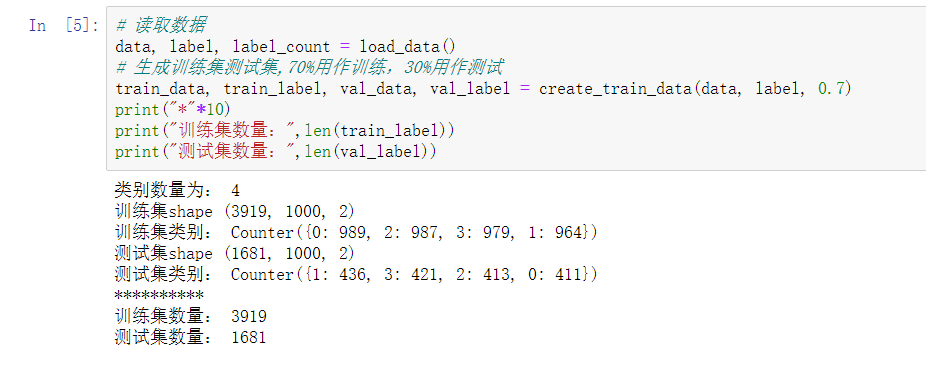
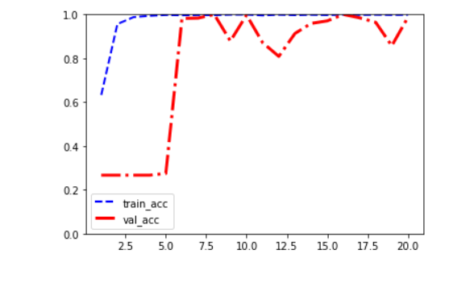
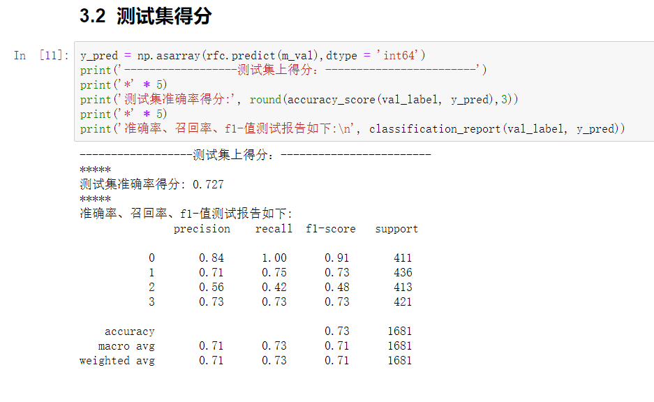
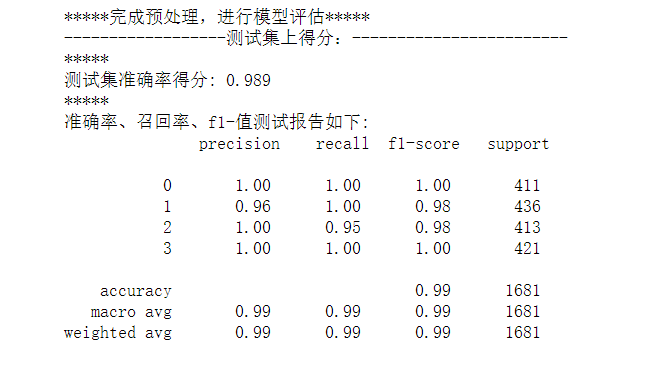

# Bearing Fault Diagnosis

An open, cleaned-up research project for rolling bearing fault diagnosis using both classical machine learning and deep learning.

This repository reproduces a compact end-to-end workflow based on the Case Western Reserve University bearing dataset:

- load raw vibration `.mat` files
- build a four-class diagnostic dataset
- train baseline and deep models
- compare model performance with notebook-friendly experiments

## Why This Repo

- Reorganized for public GitHub sharing instead of a local coursework-style layout
- Covers the full path from raw signal data to model evaluation
- Includes both a traditional baseline and neural-network models
- Keeps large datasets, logs, checkpoints, and private files out of version control

## Task Definition

The project builds a four-class bearing fault diagnosis task:

- Normal
- Inner-race fault
- Ball fault
- Outer-race fault

## Models

- Random Forest
- 1D CNN
- 1D CNN + ResNet

## Reported Results

The following validation accuracies come from the current notebook outputs in this project:

| Model | Validation Accuracy |
| --- | ---: |
| Random Forest | 0.727 |
| 1D CNN | 0.833 |
| 1D CNN + ResNet | 0.989 |

## Visual Preview

| Sample Distribution | CNN + ResNet Training Curve |
| --- | --- |
|  |  |

| Random Forest Score | CNN + ResNet Score |
| --- | --- |
|  |  |

## Repository Layout

```text
.
|-- assets/
|   `-- figures/                         # Lightweight result figures kept for the repo page
|-- artifacts/                           # Local outputs, ignored by Git
|   `-- README.md
|-- data/                                # Local raw datasets and documents, ignored by Git
|   `-- README.md
|-- notebooks/
|   |-- 01_data_preparation.ipynb        # Build processed samples from raw .mat files
|   `-- 02_model_training.ipynb          # Train and evaluate all models
|-- src/
|   `-- bearing_fault_diagnosis/
|       |-- __init__.py
|       `-- models.py                    # Preferred model implementation
|-- n_model.py                           # Compatibility shim for older notebook code
|-- requirements.txt
`-- README.md
```

## Quick Start

### 1. Create an environment

```bash
python -m venv .venv
.venv\Scripts\activate
pip install -r requirements.txt
```

### 2. Prepare the raw data

Place the CWRU bearing dataset files under the local `data/` directory.

This repository does not commit the raw dataset because it is large and should stay separate from the public source tree.

### 3. Run the notebooks

Open the notebooks in order:

1. `notebooks/01_data_preparation.ipynb`
2. `notebooks/02_model_training.ipynb`

The notebooks are already adjusted to the cleaned project structure and will read or write generated files under `artifacts/`.

## Implementation Notes

- Preferred source code lives in `src/bearing_fault_diagnosis/`.
- `n_model.py` is kept only for backward compatibility with the original notebook import pattern.
- Generated arrays, trained weights, and TensorBoard logs are written to `artifacts/`.
- Large local data and generated artifacts are excluded through `.gitignore`.

## Dataset Note

This project is organized around the Case Western Reserve University bearing fault dataset. If you publish or redistribute derived work, please make sure your usage complies with the dataset's original terms and citation expectations.

## GitHub Publishing Note

This repository has already been cleaned for public upload:

- large files are ignored
- notebooks use the new folder layout
- result figures use GitHub-friendly filenames
- the root directory is reduced to code, notebooks, docs, and lightweight assets

If you want, the next step is simply:

```bash
git add .
git commit -m "Polish README and prepare public repo"
git remote add origin <your-github-repo-url>
git push -u origin main
```
